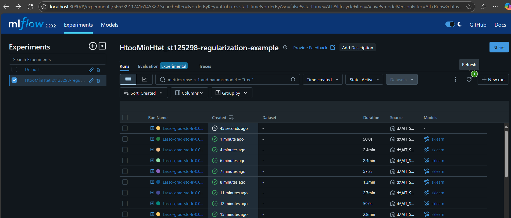
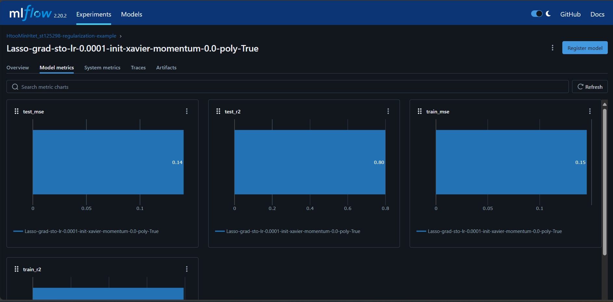

Assignment-2 // Car_price_prediction_New_Model 
Htoo Min Htet - st125298

In this Assignemt2 I continue with A1 assignment and replace the modeling part with the custom linear class implementinig R2_score, 
Xavier_initialization, Feature importance plot, polynomial regularization.
Tracking the model training with mlflow tracking and server and deployed on the ml_brain server. 
Deployment_Link- [st125298.ml.brain.cs.ait.ac.th]

### Below are some screen captures form mlflow tracking and deployment web 

